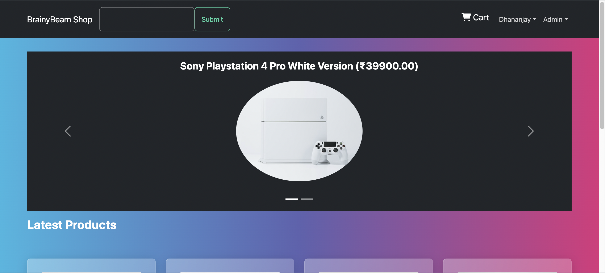
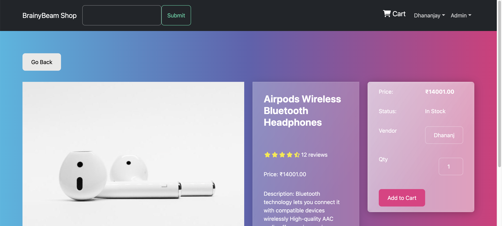
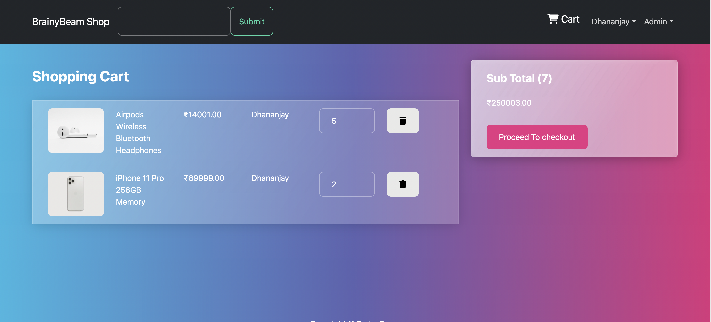
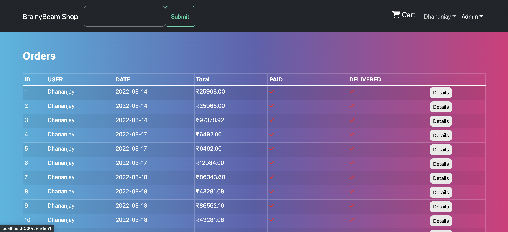
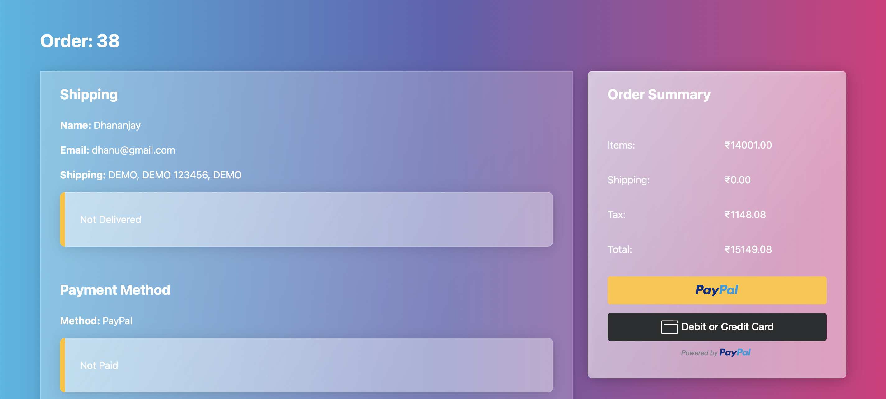
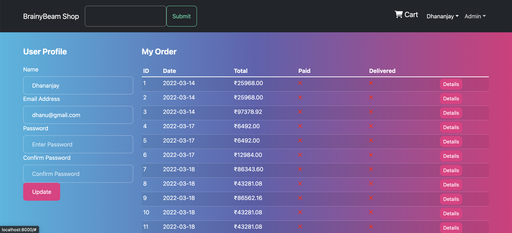

<div id="top"></div>
<div align="center">
  <h2 align="center">Ecommerce</h2>
  <p align="center">
    <a href="#" target="_blank">View Demo(Pending)</a>
    ·
    <a href="https://github.com/dhanu0510/ecommerce-django-frontend.git" target="_blank">Frontend Code</a>
  </p>
</div>

  <h2>Table of Contents</h2>
  <ol>
    <li>
      <a href="#about-the-project">About The Project</a>
      <ul>
        <li><a href="#features">Features</a></li>
        <li><a href="#built-with">Built With</a></li>
      </ul>
    </li>
    <li>
      <a href="#getting-started">Getting Started</a>
      <ul>
        <li><a href="#installation">Installation</a></li>
      </ul>
    </li>
    <li>
        <a href="#screenshots">Screenshots</a>
    </li>
  </ol>

## Features

- User Authentication
  - Login
  - Register
- Create Cart
- Admin Panel
  - Create Product
  - Update Product
  - Delete Product
  - View Products
  - View Orders
  - View Users
- Payment Gateway
  - Paypal
- Buy Same Product From Different Vendor

## Built With

- [React.js](https://reactjs.org/) (Frontend)
- [Redux](https://redux.js.org/) (Used for state management)
- [Django](https://www.djangoproject.com/) (Backend)
- [JWT](https://jwt.io/) (Used for authentication)
- [Django Rest Framework](https://www.django-rest-framework.org/) (Used for API)
- [Sqlite3](https://www.sqlite.org/) (Used for database)

<p align="right">(<a href="#top">back to top</a>)</p>

## Installation

1. Clone the repo
   ```sh
   git clone https://github.com/dhanu0510/ecommerce-django.git
   ```
2. Open the `ecommerce-django` folder
   ```sh
   cd ecommerce-django
   ```
3. Create Python Environment and Install Dependencies

   ```sh
    python -m venv venv
    source venv/bin/activate
    pip install -r requirements.txt
   ```

4. Run the server

   ```sh
    python manage.py runserver
   ```

   (Note: username : 'admin@gmail.com' and password : 'admin')

   <br/>

   Homepage : `http://localhost:8000/`
   <br/>
   Admin : `http://localhost:8000/admin/`

<p align="right">(<a href="#top">back to top</a>)</p>

## Screenshots

<div style="display:flex;flex-wrap: wrap;">
    
    
    
    
    
    
</div>
